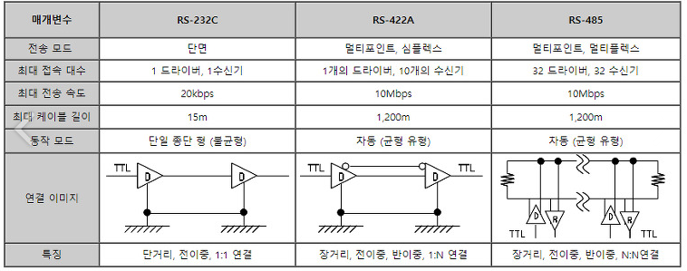
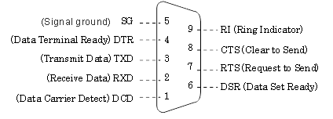
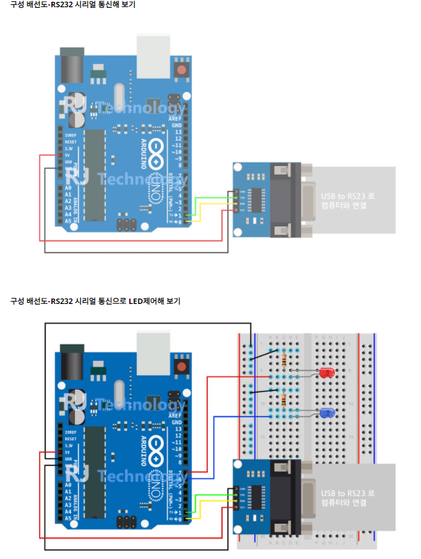

# Serial 통신

## 시리얼(Serial) 통신

- 임베디드 시스템에서 데이터를 주고 받을때 주로 사용하는 통신방법(parallel, serial이 있다.)
- 병렬 데이터를 직렬로 바꿔서 전송
- 하나 또는 두개의 전송 라인을 사용하여 데이터를 송수신한다.
- **먼저, [동기식과 비동기식](https://github.com/cdh3261/Arduino/blob/master/%EB%8F%99%EA%B8%B0%EC%8B%9D_%EB%B9%84%EB%8F%99%EA%B8%B0%EC%8B%9D_%ED%86%B5%EC%8B%A0.md) 통신을 알 필요가 있다.**

## 시리얼 통신규격(RS-232C, RS-422A, RS-485)

### 

### RS-232C

- 다양한 응용 분야에서 채택되어 사용 중이다.
- EIA-232라고도 한다.

참고링크 http://blog.daum.net/rockjjy99/2619