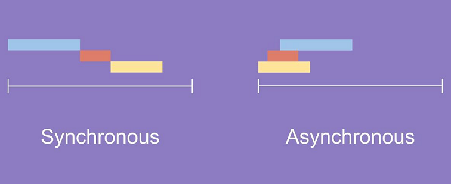
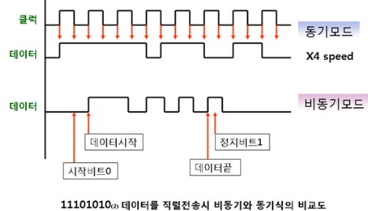

# 동기식과 비동기식 통신

통신에 앞서 동기식(Synchronous)과 비동기식(Asynchronous) 함수부터 다루겠다. (본인이 너무 헷갈려서..)

  

## ☝️ 함수

### 동기 처리

**# 순차적 # 직렬적**

들어오는 순서대로 처리하는 방법이다. 요청을 보내고 응답을 받아야지만 다음 동작이 이루어진다. **(요청과 결과가 동시에 일어난다, 작업 처리 단위가 동시)**

예를 들어, Queue에 1, 2, 3 이 들어오고 1에 대한 결과 값을 받지 못한다면 2, 3으로 진행이 불가하다.

 

### 비동기 처리

**#  병렬적**

동기 처리와는 다르게 요청따른 응답을 받지 않아도 다음 요청이 행해지는 처리 방법이다.

예를 들어, Queue에 1, 2, 3이 들어오고 1에 대한 결과 값이 나오지 않아도 2번 요청이 가능하고 2번에 따른 답을 먼저 받을 수 있다.

그렇다면 비동기 처리는 왜 필요할까?
👉 데이터를 서버로 부터 받아온다고 가정해보자. 해당 데이터를 요청했지만 서버에서 시간이 오래 걸린다. 이때, 비동기 처리로 진행이 되면 기다리는 시간동안 다음 작업을 수행할 수 있다.

 

 

 

## ✌️ 통신

전체적인 흐름은 위에서 말한 함수와 같지만 통신은 비트를 주고 받는 것으로 이해해야한다.

 

### 동기

동기식은 직렬 통신으로 정해진 비트가 한 묶음으로 전송된다. 작업 처리 단위가 동일하므로 송수신 측이 하나의 기준을 가져서 동작해야한다. 고로 **클럭(clock)이라는 동기신호가 필요**.

수신측에서 클럭으로 비트를 구별하므로 데이터 전송과 클럭 신호가 필요하다.

대표적으로 전화교환망, ATM

 

### 비동기

병렬식으로 한번에 여러 비트를 송수신한다. 시작부분은 시작비트, 끝부분은 정지비트
불규칙한 데이터 전송에 적합한 통신기법.

대표적으로 RS-232 

 

 

 

|        |                             장점                             |                             단점                             |
| :----: | :----------------------------------------------------------: | :----------------------------------------------------------: |
|  동기  | 👉 (함수적)설계가 간단하고 직관적이다.(통신에서는 동기 회로가 클럭때문에 복잡하다.) 👉 전송효율이 높다.(고속) | 👉 응답이 올때까지 아무것도 못하고 대기해야 한다. 👉 클럭 신호가 더 필요하므로 가격이 높다. |
| 비동기 | 👉 응답이 올때까지 시간이 걸리더라고 그 동안 다른 작업을 수행할 수 있다. 👉 자원을 효율적으로 사용한다. 👉 접속장치, 기기들이 간단하므로 가격이 싸다. |     👉 설계가 복잡하다. 👉 시작, 정지 비트로 오버헤드     |

