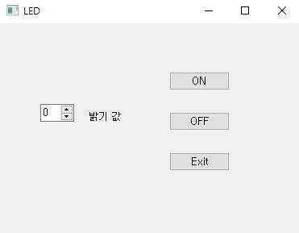
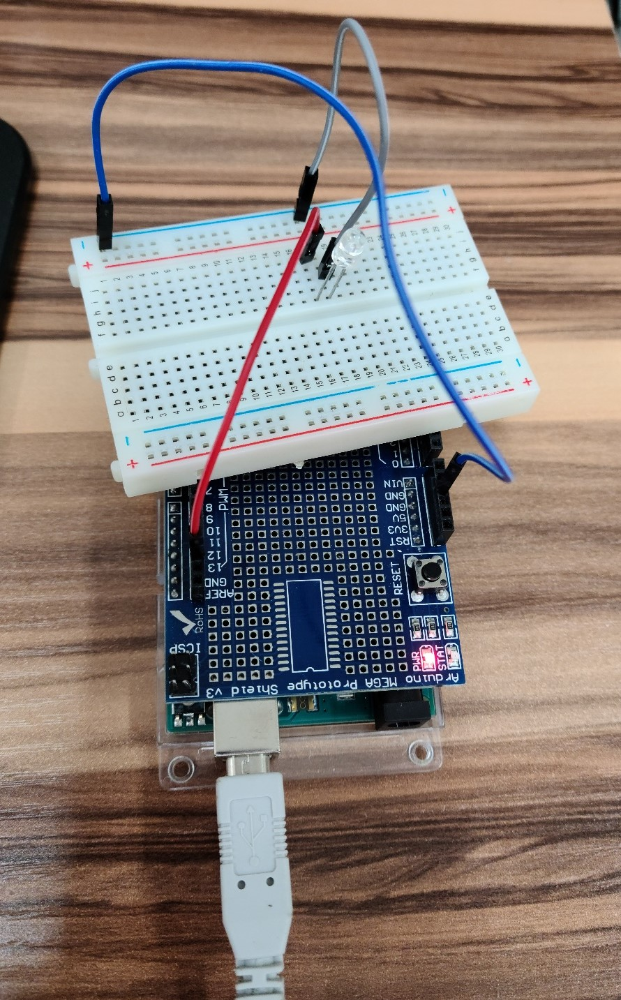
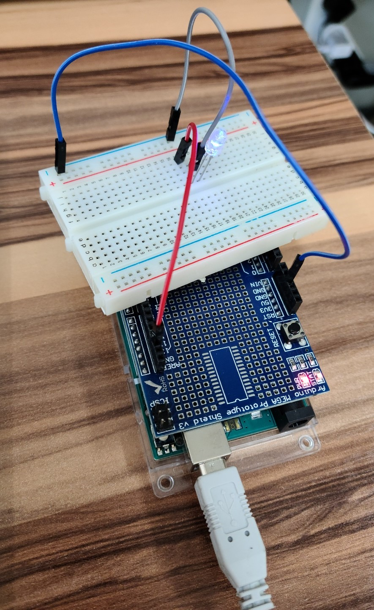
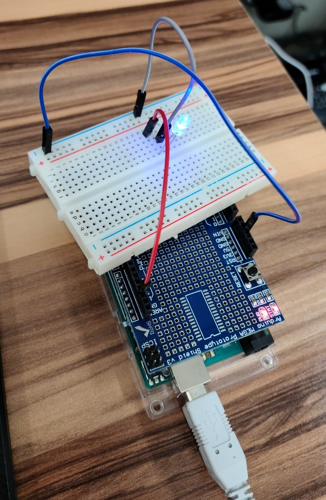

# 파이썬 아두이노 통신

<br/>

## 아날로그 LED 밝기 조절

**# Serial통신 # 비동기 # PyQt5 # VS Code**

<br/>

PyQt5에서 간단한 UI를 만들고 파이썬에서 숫자값을 받아 아두이노로 통신 후 LED 밝기 조절을 해본다.
(Class 사용을 별로 해본적이 없어 파이썬 코드가 이상할 수 있어요..💪)

밝기값을 조정하고 ON을 누르면 해당 값으로 밝기가 켜짐. OFF는 LED 끄는 것. Exit는 프로그램 종료.

<br/>

<br/>

1.  PyQt5에서 UI 만들기

<p align="center"></p>

<br/>

2. PyQt 코드

   **참고** 파이썬과 아두이노 통신할때 넘어가는 값들이 문자열로 넘어감.(파이썬에서 숫자로 보내고 아두이노에서 숫자로 받아도...)
   시리얼모니터에서 문자로 값이 들어오는 것을 보고 Serial.write를 할때 문자값을 encode해서 보내줌

   ```python
   from PyQt5.QtCore import QCoreApplication
   from PyQt5.QtWidgets import *
   from serial import Serial
   from PyQt5 import uic
   import sys
   
   
   # UI파일은 Python 코드 파일과 같은 디렉토리에 위치해야한다.
   form_class = uic.loadUiType("test01.ui")[0]
   # 아두이노와 통신
   ArduSerial = Serial('COM5', 115200)
   
   
   #화면을 띄우는데 사용되는 Class 선언
   class WindowClass(QMainWindow, form_class) :
   
       def __init__(self) :
           super().__init__()
           self.setupUi(self)
           self.setWindowTitle("LED")
           # self.setGeometry(300,300,300,300)
   
           # 필요한 변수
           self.num01_V = 0
   
           # (Designer의 objectName 이름).clicked.connect()
           self.pushButton1.clicked.connect(self.button1Function)
           self.pushButton2.clicked.connect(self.button2Function)
           self.num01.valueChanged.connect(self.num01Change)
           
           # Exit버튼을 누르면 프로그램 종료
           self.exit.clicked.connect(QCoreApplication.instance().quit)
   	
       # On버튼
       def button1Function(self):
           print('On')
           print(self.num01_V)
           ArduSerial.write(str(self.num01_V).encode('utf-8'))
           
   	# Off버튼
       def button2Function(self):
           print('Off')
           ArduSerial.write('0'.encode('utf-8'))
   	
       # 가변상자
       def num01Change(self):
           n = self.num01.value()
           self.num01_V = n
           print(self.num01_V)
   
   
   if __name__ == "__main__" :
       #QApplication : 프로그램을 실행시켜주는 클래스
       app = QApplication(sys.argv) 
   
       #WindowClass의 인스턴스 생성
       myWindow = WindowClass() 
   
       #프로그램 화면을 보여주는 코드
       myWindow.show()
   
       #프로그램을 이벤트루프로 진입시키는(프로그램을 작동시키는) 코드
       app.exec_()
   ```

   <br/>

2. 아두이노 부품 연결

<p align="center"></p>

<br/>

4. 아두이노 코드

   ```c
   void setup() {
     Serial.begin(115200);
     pinMode(13,OUTPUT);
   }
   
   void loop() {
     if (Serial.available()) {
       // 파이썬에서 값이 넘어올때 숫자도 문자로 넘어와서 문자를 숫자값으로 바꿔주기 위해 parseInt 사용.
       long value = Serial.parseInt();
       analogWrite(13, value);
     }
   }
   ```

<br/>

5. 결과

🕐 LED 값 15로 주었을 때

<p align="center"></p>

<p align="center"></p>


<br/>

<br/>

🕑 LED 값 99로 주었을 때

<p align="center"></p>

<p align="center"></p>


### 다음은 간단한 모터제어 예정..!

